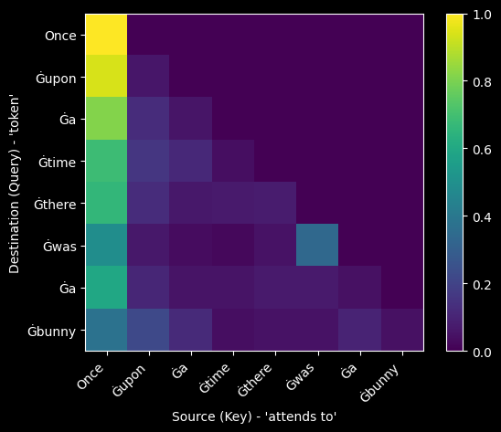
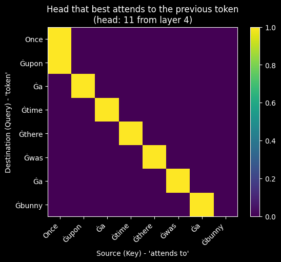
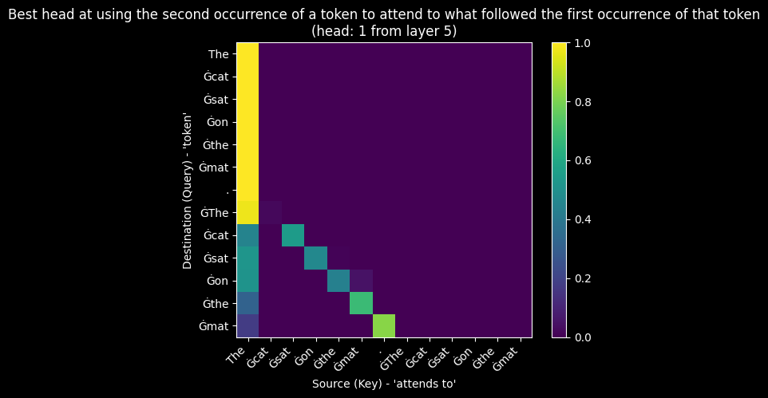
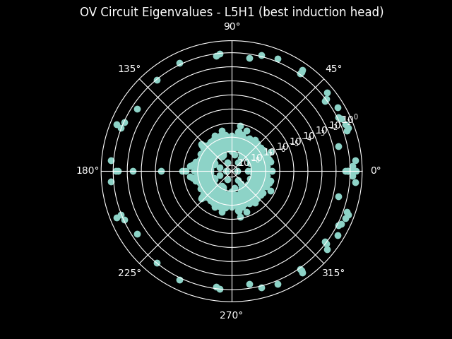
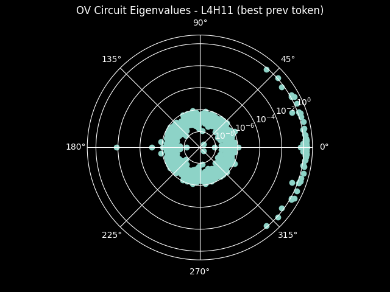
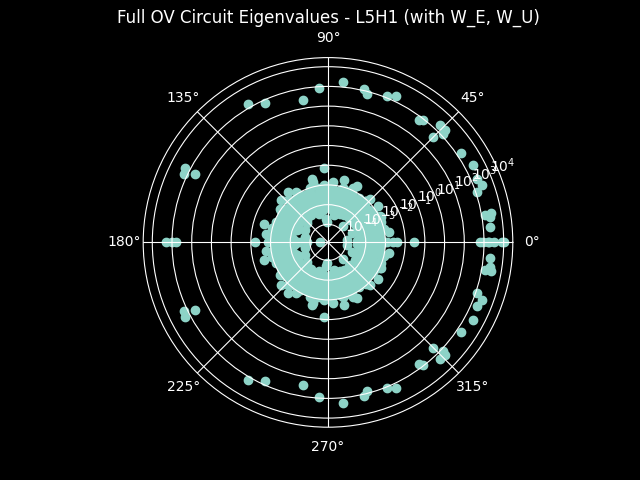
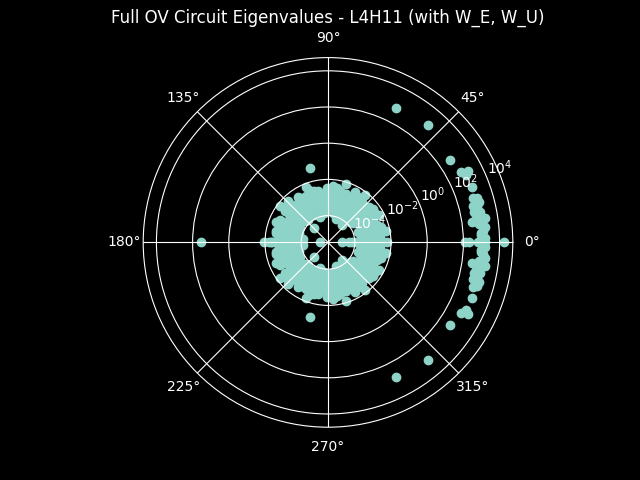

# Attention Patterns from Scratch

My personal learning project for **mechanistic interpretability**. I built this repo to teach myself how attention heads in GPT-2 specialize to perform distinct functions, by implementing everything from scratch.

Following Anthropic's [A Mathematical Framework for Transformer Circuits](https://transformer-circuits.pub/2021/framework/index.html), I progressively discover specialized circuits through hands-on experimentation.

## Learning Progression

### 1. Manual Attention Verification
**Goal:** Prove understanding by implementing attention from scratch and matching HuggingFace's output exactly.

```
uv run python examples/01_manual_attention.py
```

**Result:** Manual implementation matches HuggingFace with **zero difference**.



*Attention pattern for Layer 0, Head 0. The lower triangular structure shows the causal mask: tokens can only attend to past positions.*

---

### 2. Previous-Token Head Discovery
**Goal:** Find attention heads that specialize in attending to the immediately preceding token.

```
uv run python examples/02_previous_token.py
```

**Result:** Top previous-token heads discovered:

| Rank | Layer | Head | Score |
|------|-------|------|-------|
| 1 | 4 | 11 | **0.9999** |
| 2 | 3 | 2 | 0.5869 |
| 3 | 7 | 0 | 0.5215 |
| 4 | 2 | 2 | 0.5021 |
| 5 | 3 | 7 | 0.4341 |



*Layer 4, Head 11 shows near-perfect diagonal attention: each token attends almost exclusively to the previous token.*

---

### 3. Induction Head Discovery
**Goal:** Find heads that implement in-context learning via pattern matching: *"I saw [A][B] before. Now I see [A] again. Predict [B]."*

```
uv run python examples/03_induction_heads.py
```

**Result:** Top induction heads discovered:

| Rank | Layer | Head | Score |
|------|-------|------|-------|
| 1 | 5 | 1 | **0.5905** |
| 2 | 5 | 5 | 0.5662 |
| 3 | 8 | 1 | 0.3847 |
| 4 | 5 | 0 | 0.3723 |
| 5 | 5 | 8 | 0.3453 |



*Layer 5, Head 1 on repeated text "The cat sat on the mat. The cat sat on the mat": the second occurrence of each token attends to what followed its first occurrence.*

---

### 4. QK/OV Circuit Eigenanalysis
**Goal:** Decompose attention into two circuits and analyze their eigenvalue structure:
- **QK Circuit** (W_Q @ W_K.T): determines *where* to attend
- **OV Circuit** (W_V @ W_O): determines *what* information flows through

```
uv run python examples/04_qk_ov_circuits.py
```

**Result:** Copying scores from OV circuit eigenanalysis:

| Head | Role | Copying Score | Interpretation |
|------|------|---------------|----------------|
| L5H1 | Induction | 0.41 | Selective transformation |
| L4H11 | Previous-token | **0.96** | Near-pure copying |

| L5H1 (Induction Head) | L4H11 (Previous-Token Head) |
|:---------------------:|:---------------------------:|
|  |  |

*Polar plots of OV circuit eigenvalues. L4H11's eigenvalues cluster on the positive real axis (0 degrees) indicating copying behavior, while L5H1's eigenvalues are scattered, indicating more complex information transformation.*

#### Full OV Circuit (with Embeddings)

The basic OV circuit operates in residual stream space. But the paper also analyzes the **full circuit** including embedding and unembedding matrices: `W_U @ W_OV @ W_E.T`. This [n_vocab, n_vocab] matrix directly answers: "If token X is attended to, how much does it increase the logit for token Y?"

| Head | Basic OV Score | Full OV Score | Change |
|------|---------------|---------------|--------|
| L5H1 | 0.41 | **0.58** | +0.17 |
| L4H11 | 0.96 | **0.96** | 0 |

| L5H1 (Full OV) | L4H11 (Full OV) |
|:--------------:|:---------------:|
|  |  |

The induction head's copying score increases when we include embeddings: its job is to copy *token identity*, and the embedding matrices connect residual stream directions to actual tokens. L4H11 remains unchanged: it was already a near-pure copier in residual stream space.

---

## Key Discoveries

| Circuit | Head | Function |
|---------|------|----------|
| Previous-Token | L4H11 | Copies information from position i-1 to position i |
| Induction | L5H1 | Pattern-matches repeated sequences for in-context learning |

The **induction head** (L5H1) builds on the **previous-token head** (L4H11): this is why induction heads appear in later layers. Together, they form the core mechanism for in-context learning in transformers.

## Setup

```bash
uv sync
uv run python examples/01_manual_attention.py
```

Requires Python 3.12+. Dependencies: `torch`, `transformers`, `matplotlib`.
